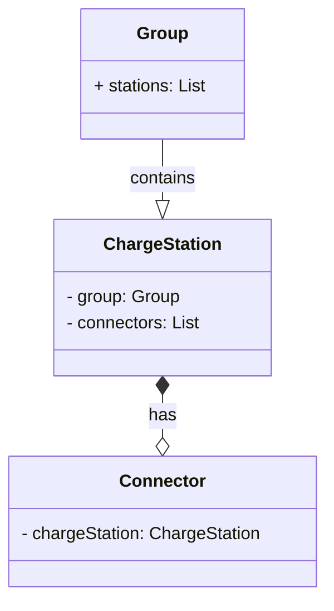

# ChargeStation Project
In this simple project, we have several charging stations that are placed in a group and have some connectors.
The group contains a unique identifier (unchangeable), name (changeable), and capacity in amps (changeable/greater than 0).

The charging station includes a unique identifier (unchangeable), name (changeable), and multiple connectors (minimum 1, maximum 5).

The connector contains the ID (unchangeable/unique per charging station with possible values between 1 and 5) and the maximum current in amps (changeable / value greater than 0).

Regarding the performance of the project, it should be said that the charging station exists only in one group and no connector is without a charging station. Whenever a group is deleted, all the charging stations in the group are also deleted and only one station can be deleted or registered from the group in each request.
It is also possible to edit the value of the maximum current in amps per connection and
It is worth noting that, in a group, the capacity in amps must always be equal to or greater than the set of maximum currents in amps of the connectors of all charging stations in the group.

#Technical Requirements: 
- .NET 5.0.17 SDK and Runtime
- VS Code or Visual Studio
- MS SQL Server Express

# Architecture Overview (Clean Architecture)
- Domain Layer (Entities and Events definitions are here)
- Application Layer (Entity-related services, Event Handlers, etc. are defined here)
- Infrastructure Layer (Data Access)
- WebApi Layer (Presentation)
